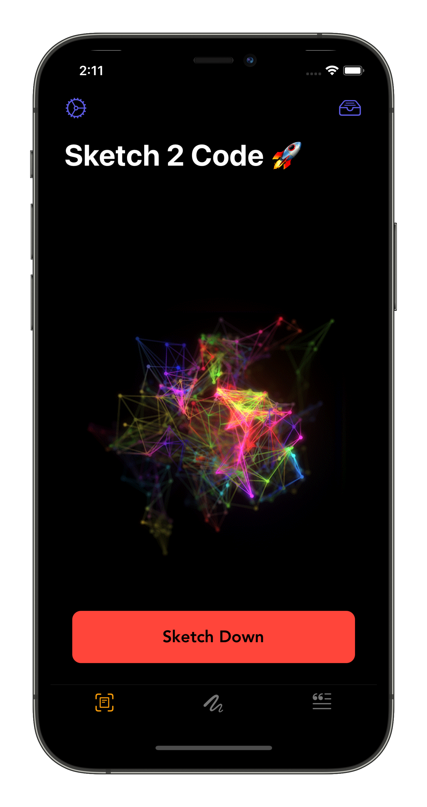
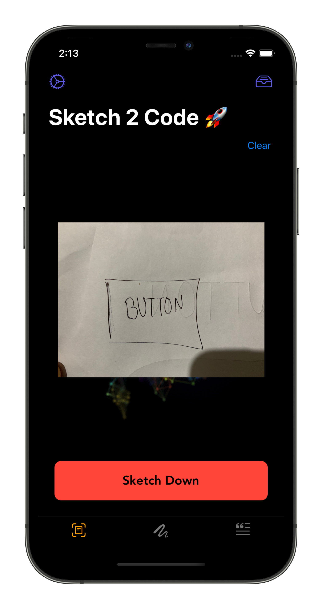
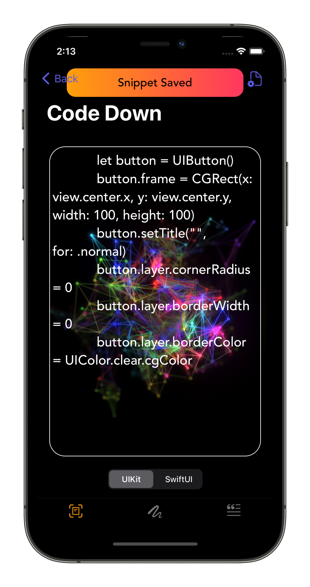
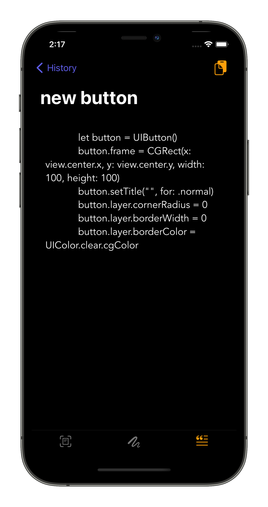
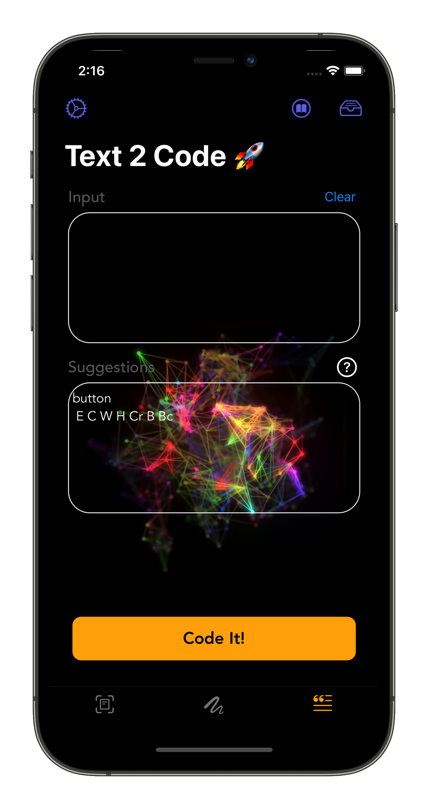

<p align="center" width="100%">
 
  

</p>


 
 
 
 
 
 

 


[](https://github.com/MLH-Fellowship/pod-3.1.0-Sketch2Code)


# Sketch2Code🚀
Sketch-2-Code is a project which focuses on making coding easier and simpler. When it comes to coding in Swift, if we have any* doubts we refer to tutorials, blogs, etc, that was the usual way, But no more old procedures. Sketch-2-Code is the new & faster method to find help. Provide your UI Sketch or Text down your requirements and get instant output snippets with ready-to-use implementations of UIElements by S2C(Sketch 2 Code).

# Inspiration❤️

Our core mission is to increase the efficiency of the typical App development workflow & removing the redundant & time-consuming bits from the process by providing an easily accessible & automated solution where user can just provide a Sketch of UI and code will be autogenerated. This is how Sketch 2 Code came into existence. 

When we thought of something like this we were clueless on how to start and build this product. But later with the flow we tried various techniques, various languages and got one which would suit our requirements. Eventually with time we made the normal procedure more easy and user friendly to developers by integrating Machine Learning models into S2C. 

We also realised that it wasn't convenient for all to draw a Sketch of UI and hence also added another feature called Text 2 Code which is an even easier way where user can just type-in their requirements and the code wil be generated.

# Architecture
The Sketch2Code solution uses the following elements:

<p align="center" width="100%">
 
</p>

# How to run ?⚙️

* Clone or download the app from this repository. 👩‍💻
* Open project file in terminal. 💻
* Open ```Swift Co-Pilot.xcodeproj``` in the app folder. 💾
* Change the bundle identifier. ⚙️
* Press Ctrl + R to run the app. 📲
* Do star this repo and/or contribute if you like it.🙂 

# How to Generate Code ?
In total we have 2 types of code generators:

## Sketch 2 Code✏️
Rigt now we have two type of Sketch 2 Code conversion:

### 1. Single Elelemnt Detecion

- In this we have concentrated on single UIElelement detection. There are times when developers need code of a specific type of UIElement.
- So in such cases users can go on with using the Single Element Detection.

#### Rules
- While using this feature developer need to provide the name of the element above and its shape.
- Providing name is really important
- And for elements like Buttons, TextFields user need to provide its shape too.

<!-- #### Elements which can be detected
| Elements  | Sketch |
| -- | -- |
| Buttons | ✅ |
| TextFields | ✅ |
| TextView | ✅ |
| Segment Control | ❌ |
| Labels | ❌ |
| Switches | ❌ | -->

### Quick Demo


Make sure you spell the element type correctly🪄

### 2. UI Screen Detection

- As the project tite suggests our prior motve was to ease the work of coding UI stuffs.
- If you want to get code of a particular UI screen then you can use this feature.

<!--#### Elements which can be detected
1. ImageView(I)
2. Buttons(BUTTONS)
3. TextField(TF)-->

### Quick Demo

 

Make sure you draw a rectangle box and add your UIElements inside it.

Make sure you spell the element type correctly🪄. 

You need to follow the naming type as given above.

## Text 2 Code 💬
- Text 2 Code is an additional feature which we have added for people who are not good in sketching😅. 
- Using Text 2 Code is really easy and simple, just start writing the element type and the suggestion box in the app will show you the order of writing.
- While writing the text you need to follow a set of order, which will be provided automatically by the App.

<!--#### Elements which can be detected
1. Buttons
2. Labels-->

# Snapshots of App 📸
<p align = "centre">




 


# Features ⚡️
- ```Sketch to Code``` provides code snippet for UIElements in Swift & SwiftUI.
- ```Text to Code``` generates code snippet based on text provided.
- ```Save Snippet``` saves code snippets to our backend.

# Sponsor Technology
 

# Tech Stacks 🖥

<table>
<tr><td>

| Tech Stacks | Logo |
| -- | -- |
| Xcode |  |
| Swift |  |
| IBM Annotations|  |
| CreateML|  |
| Python |  |

 </td><td> 
 
| Tech Stacks | Logo |
| -- | -- | 
| PyCharm |  |
| HTML |  |
| Heroku |  |
| CockroachDB |  |
| Postman|  |
 
</td></tr> </table>
 
# Libraries📒
- UIKit
- SwiftUI
- VisionKit
- CoreML
- ImageIO
- [Loafjet](https://github.com/Loafjet/Loafjet)
- [Alamofire](https://github.com/Alamofire/Alamofire)

# What's next? 📱

With the upcoming releases we have thought of bringing various new features like:

I.   Multiple Coding Language Support

II.  Add more UIElements

III. Adding enhanced NLP in Text2Code, to make it more versatile

IV.  Make object detection more enhanced

V.   Release Sketch2Code as a Beta release to know user feedback

# Warnings ⚠️
- Right now S2C is not powerful enough to support all the UIElements that come with Xcode but, we are working on a top-down approach of covering the most used UIElements with the best possible accuracy.
- When we say provide Sketch and Text you do need to follow a few practices with your inputs to use S2C.
- With upcoming versions we focus on making S2C more powerful and more versatile

## Requirements to Run 🚩
- Xcode 12+
- Swift 5+
- PyCharm


## MLH Pre-Fellowship( Summer 2021)

> This is a hackathon project made by MLH Fellows - Pod 3.1.0 i.e. Recursive Rhinos - Team 4


# Project Maintainers 👨🏻‍💻

|                                                                                         <a href="https://github.com"></a>                                                                                         | <a href="https://gokulnair2001.wixsite.com/mysite"></a>    | <a href="https://github.com/prabal4546"></a>|
| :------------------------------------------------------------------------------------------------------------------------------------------------------------------------------------------------------------------------------------------------------------------------------------------------------------------------------------------: | :------------------------------------------------------------------------------------------------------------------------------------------------------------------------------------------------------------------------------------------------------------------------------------------------------------------------------------------:| :------------------------------------------------------------------------------------------------------------------------------------------------------------------------------------------------------------------------------------------------------------------------------------------------------------------------------------------:|
|                                                                                                                                        **[Alex](https://github.com/amin-codes)**                                                                                                                                        |**[Gokul Nair](https://www.linkedin.com/in/gokul-r-nair/)**            | **[Prabaljit Walia](https://www.linkedin.com/in/prabaljit-walia-5800571a0/)**            |
| </a> </a>  </a> | <a href="https://www.instagram.com/_gokul_r_nair_/"></a> <a href="https://twitter.com/itIsGokulNair"></a>  <a href="https://www.linkedin.com/in/gokul-r-nair/"></a> |<a href="https://instagram.com/prabal4546?igshid=hq0bl8q25kur"></a> <a href="https://twitter.com/PrabaljitW"></a>  <a href="https://www.linkedin.com/in/prabaljit-walia-5800571a0/"></a> |

## Team
| GitHub Usernames                                      | Domain                     |
| ----------------------------------------------------- | -------------------------- |
| [@gokulNair](https://github.com/gokulnair2001)      | iOS App  + Documentation |
| [@prabaljitWalia](https://github.com/prabal4546)        |  iOS App + Documentation |
| [@Alex](https://github.com/amin-codes) | Backend |

- Feel free to contribute 💪🏼 

<p align="center" width="100%">
   Made with ❤️ By Developers   
</p>

